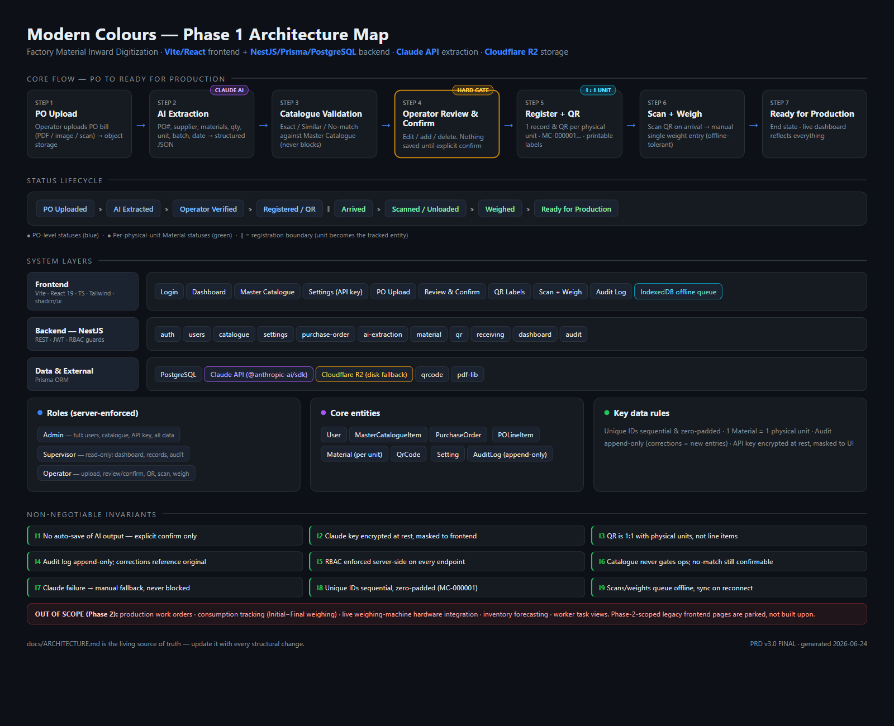

<p align="center">
  
</p>

<h1 align="center">Modern Colours — Factory ERP</h1>

<p align="center">
  AI-powered Purchase-Order extraction, per-unit QR tracking, department stock issuing,
  and finished-goods dispatch for a paint manufacturing facility.
</p>

<p align="center">
  
  
  
  
  
  
  
</p>

---

> **Document version:** 3.0  
> **Last updated:** 2026-07-21  
> **Describes:** Phases 1–3, live in production since 2026-07-03.  
> **Full history:** [`docs/CHANGELOG.md`](./docs/CHANGELOG.md) · earlier doc versions in [`docs/archive/`](./docs/archive/)

---

## Start here — orientation for a new developer or agent

Read in this order:

| Doc | What it gives you |
|---|---|
| This README | The product, the stack, the invariants, how to run it |
| [`docs/ARCHITECTURE.md`](./docs/ARCHITECTURE.md) | The **current** live architecture, all three phases |
| [`docs/CHANGELOG.md`](./docs/CHANGELOG.md) | What was built and when, reconstructed from git |
| [`docs/PROGRESS.md`](./docs/PROGRESS.md) | The build log, session by session |
| [`docs/FIELD_REFERENCE.md`](./docs/FIELD_REFERENCE.md) | Every database column and what it means |
| [`docs/DEPLOYMENT.md`](./docs/DEPLOYMENT.md) | The live deployment and its hard-won gotchas |
| [`docs/HANDOVER.md`](./docs/HANDOVER.md) | Handover day, and the database flush |
| [`docs/archive/`](./docs/archive/) | Superseded doc versions, kept so you can see the system evolve |

**Live since 2026-07-03.** Phases 1, 2 and 3 are complete and in production use.

### The six logins

Roles are enforced **server-side**; the UI only hides what the server already refuses.
Eight roles are live *(verified against production 2026-07-24)*. Every seed uses a
**placeholder default that MUST BE CHANGED** before real use — **no password is printed in
this repo, ever.**

| Role (enum) | Displayed as | Login | Scope |
|---|---|---|---|
| `ADMIN` | **Store** | `admin@moderncolours.local` | Stock: accepts inwards, receives (session-gated), issues, catalogue, API key, users. **No longer does the inward document flow** (that is the Gate's). |
| `OVERSIGHT` | **Admin** (owner) | `oversight@moderncolours.local` | **Read-only across everything** — dashboards, stock, batches, packing, scan sessions, GRN slips, the full audit. Its ONE named write is the finished-goods **correction** (`CorrectionsGuard`); it also holds the **reprint-approval** and **flag-flip** doors. |
| `OPERATOR` | **Gate** | `gate@moderncolours.local` | The inward: photograph the invoice, proofread, **Confirm & hand over — which MINTS the MC- codes** onto the Good Receipt Note. No stock, labels, catalogue or dashboard. |
| `PRODUCTION_HEAD` | **PU / Enamel / Powder Head** | `pu@` / `enamel@` / `powder@` | Requests, batches, output (incl. hardener/thinner) — **own department only** |
| `DISPATCH` | **Dispatch** | `dispatch@moderncolours.local` | Finished goods only — scan FG-/FGHD-/FGTH- or a carton PG- out; returns |
| `PACKER` | **Packer** | `packer@moderncolours.local` | The packing desk only — scan in, compose PG lists (straights + combos), confirm, seal, void/repack |
| `REVIEWER` | **Reviewer** | `pallavi@` / `rupinder@` | View-only: the invoice document beside its slip, nothing else |

**Note the naming trap:** the role called `ADMIN` is the **Store**, and `OVERSIGHT` is what
the factory calls **"Admin"** (the owner). Easy to wire a guard to the wrong one.

`SUPERVISOR` exists in code (read-only dashboard/records/audit) but **has no account**;
`op1@moderncolours.local` is a **deactivated** legacy OPERATOR. Create/reactivate via Users
if ever needed. The privileged roles (ADMIN, OVERSIGHT, SUPERVISOR) are **seed-only** and
can never be minted through User Management.

**Two operational flags** (both **OFF**; only the owner flips them, through the one
access-flip door):

| Flag | OFF (current) | ON |
|---|---|---|
| `STORE_INWARD_ACCESS` | Inward is the Gate's; Store cannot upload/extract/hand-over | Store regains the inward flow (reversible cutover) |
| `PACKING_STAGE` | Dispatch ships FG drums directly | Dispatch's home shows packed-goods (PG) carton cards |

Department isolation (I10) is derived from the JWT, never the request body — a head
cannot reach another department's data by editing a request.

The seeds are idempotent and split across three scripts: `prisma/seed.ts` (the admin, from
`SEED_ADMIN_*` env vars), `prisma/seed-phase2-roles.ts` (oversight + the three heads,
`SEED_PHASE2_PASSWORD`), and `prisma/seed-phase3-dispatch.ts` (dispatch, `SEED_PHASE3_PASSWORD`).

### Deployment reality

| Piece | Where | Notes |
|---|---|---|
| Frontend | **Vercel** — Ambreen's account | Deploy from *that* account; a different one changes the URL and breaks CORS |
| Backend | **Railway**, Singapore | Built from `backend/Dockerfile`, not Nixpacks |
| Database | **Neon** PostgreSQL 18.4, Singapore | `DATABASE_URL` pooled for the app, `DIRECT_URL` non-pooled for migrations |
| File storage | **Cloudflare R2** | Bucket `modern-colors-storage` |

**Auto-deploy on push to `main`** — both ends. No manual step for ordinary changes.

### Four things you would otherwise rediscover painfully

1. **Migrations hang on Neon's pooled endpoint.** PgBouncer has no advisory locks, so
   `prisma migrate deploy` against `DATABASE_URL` hangs forever rather than failing.
   Use `DIRECT_URL`.
2. **Railway healthchecks are IPv6-only.** Binding `0.0.0.0` passes the build and then
   fails the healthcheck. The app binds dual-stack `::` with an IPv4 fallback.
3. **Stage environment variables *before* the deploy that reads them.** The app fails
   fast on missing secrets by design, so a premature deploy crash-loops and looks like a
   build failure when it is only a missing value.
4. **The Jio mobile-data incident.** The app worked on office WiFi but appeared broken on
   Jio mobile data, showing a CORS error — which sent debugging to the wrong place.
   What actually mattered: `CORS_ORIGIN` must be the **exact** origin with **no trailing
   slash**; a Vercel *preview* deploy has a different origin and only affects the person
   on it; and a failed preflight on a flaky connection is indistinguishable from a CORS
   misconfiguration in the console. The API client now retries transient network
   failures. **Debug order:** confirm which URL the user is on → hit `/api/health` from
   *their* device → only then look at `CORS_ORIGIN`.

### Handover

The database is flushed before the factory takes over. `prisma/flush.ts` is built,
tested and **has never been run** — it needs `ALLOW_FLUSH=yes` *and* a typed confirmation
phrase. Read [`docs/HANDOVER.md`](./docs/HANDOVER.md) before touching it.

---

## Overview

Modern Colours receives raw materials (pigments, fillers, binders, solvents) against paper Purchase
Orders, issues them to production departments, and ships finished paint. This platform digitizes that
whole chain — from the supplier's invoice to the drum leaving the gate:

> **Phase 1 — Inward.** Operator uploads a PO → Claude extracts the line items → the operator reviews
> & confirms → the system mints one QR-coded unit per physical item → each unit is scanned on arrival
> until it is _Ready for Production_. Scanning is rapid-fire because a truckload can be ~2,500 sacks;
> each unit's stock balance comes from the PO's pack weight, not from weighing it.
>
> **Phase 2 — Requests & stock.** A department head requests materials → Store accepts, part-accepts or
> rejects each line → Store scans the drum and issues the actual weighed amount → live stock levels are
> kept by an append-only ledger, oldest stock first (FIFO).
>
> **Phase 3 — Finished goods & dispatch.** Materials are issued against a **batch** → the head records
> what that batch produced and confirms it → the system mints one `FG-` QR per drum produced → Dispatch
> scans each drum out, and any finished drum traces back to the exact raw materials and suppliers behind it.

Nothing the AI extracts is persisted until an operator explicitly confirms it, every state change is
written to an append-only audit log, stock balances can never go negative or drift from the ledger, and
the factory's own Claude API key is encrypted at rest and used server-side only.

<p align="center">
  
</p>

---

## Features

### Material inward workflow
- **PO upload** — operators upload a Purchase Order (PDF, image, or scan).
- **AI extraction** — the PO is sent to the **Claude API** (using the factory's own stored key) and parsed
  into structured line items: PO number, supplier, material, SKU, quantity, unit, batch, delivery date.
- **Manual fallback** — if extraction fails (bad key, quota, unreadable scan), the operator can enter the
  PO by hand instead of being blocked.
- **Master-catalogue validation** — every extracted material is matched against the catalogue as
  **Exact / Similar / No-match**; matching is advisory and never blocks an entry.
- **Operator review & confirm (hard gate)** — an editable table of Material / SKU / Quantity / Unit /
  Validation status. **Nothing is written to the database until the operator confirms.**
- **Per-unit registration** — on confirm, one material record is created **per physical unit** with a
  sequential, zero-padded unique ID (`MC-000001`, `MC-000002`, …).

### QR & receiving
- **QR generation** — one QR code per physical unit, encoding unique ID, material, SKU, supplier, PO,
  batch, and date.
- **Printable label sheets** — generated as PDF for printing and attaching to each unit.
- **Scan on receiving** — operators scan each unit as it is unloaded; status advances automatically.
- **Manual receiving-weight entry** — a single confirmed weight per unit (a receiving confirmation, not a
  production measurement — no weighing-machine hardware in Phase 1).
- **Offline tolerance** — scans and weight entries queue locally and sync on reconnect, so a dropped
  factory-WiFi connection never loses data.

### Master Catalogue
- One-time **Excel/CSV import** of the factory's ~500–600 SKUs (column-tolerant header mapping).
- Full CRUD with soft-delete; fuzzy match lookup powering AI-extraction validation.
- **New SKUs are addable during daily operations** — when a PO line has no catalogue match, an operator
  can add the material (with confirmation); a provisional code is generated if no official SKU exists yet.

### Settings, roles & audit
- **Settings (Admin-only)** — the Claude API key is entered, validated against a live API call, **encrypted
  at rest (AES-256-GCM)**, masked in every response, and used server-side only.
- **Role-based access control — six roles**, enforced server-side on every endpoint, not just hidden in
  the UI:

  | Role | Displayed as | Can do |
  |---|---|---|
  | `ADMIN` | **Store** | Users, catalogue, API key; approves requests and issues stock |
  | `SUPERVISOR` | Supervisor | Read-only dashboard, records, audit |
  | `OPERATOR` | Operator | Upload, review/confirm, QR, scan, weigh |
  | `OVERSIGHT` | **Admin** | Read-only across **all** departments; every mutating route rejects it |
  | `PRODUCTION_HEAD` | PU / Enamel / Powder Head | Requests, batches and output **for their own department only** |
  | `DISPATCH` | Dispatch | Finished goods only — nothing else in the system |

  Department isolation is derived from the JWT, never from the request body, so a head cannot see or
  touch another department's data by editing a request.
- **Immutable audit trail** — every status change, PO entry, and weight entry is logged with timestamp and
  operator. Corrections are new audited entries that reference the original, never silent overwrites.

### Requests & stock (Phase 2)
- **Per-material requests** — a department head raises a request from the master catalogue, so the names
  match exactly what Store will scan.
- **Per-line decisions** — Store accepts, part-accepts (with an approved quantity) or rejects **each line**
  independently, with a reason; the request's overall status is derived from the mix.
- **Scan & Issue** — Store scans the drum's QR, reviews the line, then records **Add / Deduct / Discard**.
  The **actual weighed amount** is captured, which may differ from the approved figure — both are kept.
- **Append-only ledger** — every movement is a permanent row. The ledger and the unit's balance are written
  in one transaction with the row locked, so simultaneous scans can never drive stock negative or let the
  two drift apart.
- **FIFO, softly** — oldest arrival is suggested first. Issuing newer stock while older exists **warns and
  records the override; it never blocks**, because the floor sometimes has a good reason.
- **Stock ageing** — amber at 30 days, red at 60, with an ageing view that buckets what is sitting too long.

### Finished goods & dispatch (Phase 3)
- **Batch as a real record** — not free text. Unique per department, and held on each request **line**, so
  one request can serve several batches and a trace can never break on a typo.
- **Top-ups warn, don't block** — requesting more against an already-confirmed batch is allowed; consumption
  accumulates across every request pointing at that batch.
- **Production output + confirm gate** — the head records product, package count, size, shade and date.
  **No finished-goods QR is minted until that output is confirmed**, and a second generate is refused, so a
  drum can never end up with two identities.
- **`FG-` labels** — one QR per drum produced, from its own sequence, kept deliberately distinct from `MC-`
  so a raw unit can never be mistaken for finished goods.
- **Scan-to-dispatch** — Dispatch scans each drum out; dispatching the same drum twice is rejected.
- **Full traceability** — any finished drum traces back through its batch to the exact raw-material units,
  POs and suppliers that went into it.

### Dashboard
- **A dashboard per role** — KPI cards, charts and low-stock alerts (red/amber) sized to what that role can
  actually act on. Department heads' charts are filtered server-side to their own department.
- Live metrics: today's POs, materials received, pending scans/weighing, ready-for-production counts.
- Supplier-wise and material-wise statistics.
- Search & filters by date, PO number, supplier, material name/SKU, and status.

---

## Status lifecycle

```
PO Uploaded → AI Extracted → Operator Verified → Material Registered / QR Generated
   → Arrived → Scanned / Unloaded → Weighed → Ready for Production
```

The first four are **PO-level** statuses; once registered, each **physical unit** is tracked
independently through arrival, scan, weigh, and ready.

From there Phase 2/3 continue the chain:

```
Ready for Production → issued against a Batch (ledger + balance)
   → Production Output recorded → Confirmed → FG QRs minted
   → Finished Good: Generated → Ready → Dispatched
```

---

## Tech stack

| Layer        | Technology |
|--------------|------------|
| Frontend     | Vite 6 · React 19 · TypeScript · Tailwind CSS 3 · shadcn/ui (Radix) · React Router 7 · Recharts |
| Backend      | NestJS 11 · TypeScript · REST · JWT auth + RBAC guards |
| Database     | PostgreSQL (**Neon**, hosted) · Prisma 6 ORM |
| AI           | Claude API via the official `@anthropic-ai/sdk` |
| QR & PDF     | `qrcode` (generation) · `pdf-lib` (printable label sheets) |
| File storage | Cloudflare R2 (S3 API) in production · local-disk fallback for development |
| Security     | `bcryptjs` password hashing · AES-256-GCM secret encryption · fail-fast env validation |

> **No Docker.** The database is Neon (hosted Postgres) — there is intentionally no local-Postgres /
> docker-compose setup.

---

## Monorepo layout

```
modern-colors-erp/
├── frontend/          Vite + React 19 + TS + Tailwind + shadcn/ui  (UI)
│   └── src/
│       ├── components/  ui/ (design system) · common/ · layout/
│       └── pages/       screens for all three phases
├── backend/           NestJS + Prisma + PostgreSQL  (API)
│   ├── prisma/          schema.prisma · seed.ts · migrations/
│   └── src/
│       ├── common/      guards · decorators · crypto · config (env validation)
│       ├── prisma/      PrismaService
│       └── modules/     Phase 1: auth · users · catalogue · settings · audit ·
│                        purchase-order · ai-extraction · material · qr ·
│                        receiving · dashboard
│                        Phase 2: production-request · stock
│                        Phase 3: batch · finished-goods
└── docs/              ARCHITECTURE.md · PROGRESS.md · HANDOVER.md · architecture.png · PRD
```

> **Start here for context:** [`docs/ARCHITECTURE.md`](docs/ARCHITECTURE.md) is the living architecture map
> (modules, data model, invariants); [`docs/PROGRESS.md`](docs/PROGRESS.md) is the running build log.

---

## Data model

Eight Prisma models back the platform (full schema: [`backend/prisma/schema.prisma`](backend/prisma/schema.prisma)):

| Model | Purpose |
|-------|---------|
| `User` | Accounts with `ADMIN` / `SUPERVISOR` / `OPERATOR` roles |
| `MasterCatalogueItem` | Factory SKU reference (name, SKU, category, unit, packaging) |
| `PurchaseOrder` | Uploaded PO + lifecycle status + raw extraction JSON |
| `POLineItem` | Editable pre-confirm working set (never auto-promoted to a Material) |
| `Material` | **One row per physical unit**, with unique `MC-…` ID and per-unit status |
| `QrCode` | One QR payload + rendered image per material |
| `Setting` | Encrypted key/value store (the Claude API key lives here) |
| `AuditLog` | Append-only log; corrections reference the original entry |

---

## Non-negotiable invariants

**Break these and you break the factory.** Most are backed by automated tests; the test
is named where one exists.

| # | Invariant | Enforced where |
|---|-----------|----------------|
| I1 | No auto-save of AI output — materials persist only after explicit operator confirm | `purchase-order.service.ts` confirm gate |
| I2 | Claude API key encrypted at rest (AES-256-GCM); never returned in full | `crypto.service.ts`, `settings.service.ts` |
| I3 | QR codes are 1:1 with physical units, not line items | `material.service.ts` registration loop |
| I4 | **Audit log is append-only** — corrections are new rows referencing the original. The *only* permitted exception is `prisma/flush.ts` at handover | `audit.service.ts` has no update/delete |
| I5 | RBAC enforced **server-side** on every protected endpoint | `RolesGuard` + `phase1-access.spec.ts`, `dispatch-isolation.spec.ts` |
| I6 | Master Catalogue never gates operations; no-match items are still confirmable | `catalogue.service.ts` match is advisory |
| I7 | Any extraction failure falls back to manual entry — the operator is never blocked | `extract-degradation.spec.ts` |
| I8 | Unique IDs are sequential and zero-padded (`MC-000001`, `FG-000001`, separate sequences) | Postgres sequences |
| I9 | Scans tolerate offline, queue locally, sync on reconnect; re-scans are idempotent | `receiving.service.ts` |
| I10 | **Department isolation** — a production head's department comes from the JWT, never the request body | `common/auth/department-scope.ts` |
| I11 | **Stock balance and ledger row are written in ONE DB transaction with the unit row locked `SELECT … FOR UPDATE`.** Balances can never go negative or drift from the ledger | `stock.service.ts`, `stock.service.spec.ts` |
| I12 | Finished-goods QRs cannot be minted until the production output is **confirmed**; a second generate is refused | `finished-goods.service.ts`, `qr.fg-label.spec.ts` |

### Two more that are not numbered but matter just as much

- **Label geometry is exactly 216 × 108 pt (3 × 1.5 in), one label per page.** The
  factory's label-roll printer depends on it. Locked by `qr.label-format.spec.ts` and
  `qr.fg-label.spec.ts` — do not "improve" the layout without reading those.
- **`ENCRYPTION_KEY` must never change.** It is the only thing that can decrypt the
  stored Claude API key; if it changes, that key is **unrecoverable** and a database
  backup will not bring it back. See [`HANDOVER.md`](./docs/HANDOVER.md).

---

## API surface (REST, prefix `/api`)

| Module | Representative endpoints |
|--------|--------------------------|
| `auth` | `POST /auth/login` · `GET /auth/me` |
| `users` | `GET/POST/PATCH/DELETE /users` *(Admin)* |
| `catalogue` | `POST /catalogue/import` *(Admin)* · `GET /catalogue/import/template` · `POST /catalogue/import/preview\|validate\|revalidate\|rows` · `GET /catalogue` · `GET /catalogue/match?q=` · `POST /catalogue` *(Admin+Operator)* |
| `settings` | `GET/PUT/DELETE /settings/api-key` *(Admin)* |
| `purchase-order` | `POST /purchase-orders` · `POST /:id/extract` · `POST /:id/confirm` *(the I1 gate)* |
| `material` | `GET /materials` · `GET /purchase-orders/:poId/units` · `.../labels.pdf\|zip\|csv` |
| `receiving` | `POST /receiving/scan` · `POST /receiving/:uniqueId/weight` *(correction path only)* |
| `stock` | `GET /stock/units/:id` · `POST /stock/transactions` · `GET /stock/levels` · `GET /stock/ageing` · `GET /stock/transactions` |
| `production-request` | `POST /production-requests` · `PATCH /:reqId/items/:itemId/review` *(Store)* · `GET /overview` |
| `batch` | `POST /batches` · `GET /batches` · `GET /batches/:id/trace` |
| `production-output` | `POST /production-outputs` · `POST /:id/confirm` *(hard gate)* |
| `finished-goods` | `POST /finished-goods/generate/:outputId` · `GET /by-output/:id/labels.pdf` · `POST /dispatch/scan` · `POST /dispatch/batch` |
| `analytics` | `GET /analytics/overview\|store\|my` · `GET /analytics/dispatch` *(Dispatch+Admin)* · `GET /analytics/flow` *(**Admin only** — the Company Brain)* |
| `dashboard` | `GET /dashboard/summary` · `GET /dashboard/search` |
| `audit` | `GET /audit` *(Admin/Supervisor)* |
| `health` | `GET /health` *(public — Railway polls it)* · `GET /health/storage?deep=1` *(Store/Admin)* |

Every write endpoint emits an append-only `AuditLog` entry (I4). Roles above are the
**server-side** guard, not a UI convention.

---

## Getting started

**Prerequisites:** Node.js 20+ and a [Neon](https://neon.tech) Postgres connection string.

```bash
# 1. Backend
cd backend
cp .env.example .env          # paste your Neon DATABASE_URL; set JWT_SECRET, ENCRYPTION_KEY, SEED_ADMIN_*
npm install
npx prisma migrate dev        # applies the schema to Neon
npm run seed                  # creates the initial Admin from SEED_ADMIN_* env vars
npm run start:dev             # http://localhost:3000/api

# 2. Frontend
cd ../frontend
npm install
npm run dev                   # http://localhost:5173
```

Generate strong secrets:

```bash
openssl rand -hex 32          # JWT_SECRET (≥32 chars) and ENCRYPTION_KEY (exactly 64 hex chars)
```

> The backend **refuses to boot** if `JWT_SECRET`, `ENCRYPTION_KEY`, or `DATABASE_URL` are missing or weak
> (fail-fast env validation).

The Vite dev server proxies `/api` to the backend (same-origin — no CORS), so the frontend's
`VITE_API_URL` stays `/api`.

### Testing the camera on a phone

Receive Stock (QR) and PO Upload (document photo) use the device camera, which browsers only allow on a
**secure context (HTTPS)**. To test from a phone on the same Wi‑Fi:

```bash
cd frontend
VITE_HTTPS=true npm run dev     # serves HTTPS and binds to the LAN
```

Then on the phone open `https://<your-computer-LAN-IP>:5173` (the dev server prints the Network URLs on
start). Accept the self‑signed-certificate warning once, and allow camera access when prompted. The `/api`
proxy means the backend is reached through the same HTTPS origin — no extra network config. Use the rear
camera; for PO photos, fill the frame with the document and hold steady for a sharp, high‑resolution capture.

---

## Scripts

**Backend** (`backend/`):

| Script | Description |
|--------|-------------|
| `npm run start:dev` | Run the API in watch mode |
| `npm run build` | Compile to `dist/` |
| `npm run prisma:migrate` | Create & apply a migration |
| `npm run seed` | Seed the initial Admin user |
| `npm test` | Run the Jest unit/spec suite |

**Frontend** (`frontend/`):

| Script | Description |
|--------|-------------|
| `npm run dev` | Vite dev server |
| `npm run build` | Type-check + production build |
| `npm run preview` | Preview the production build |

---

## Testing

**261 tests across 28 suites, all passing** (verified 2026-07-21).

```bash
cd backend && npm test
```

Tests exist to pin the invariants, so the suite is the fastest way to learn what must not
change. The ones worth reading first:

| Spec | Pins |
|---|---|
| `roles.guard.spec.ts`, `phase1-access.spec.ts`, `dispatch-isolation.spec.ts` | Server-side RBAC and role isolation (I5) |
| `department-scope.spec.ts` | A head cannot reach another department's data (I10) |
| `stock.service.spec.ts` | Row-locked balance + ledger in one transaction; no negative stock (I11) |
| `qr.label-format.spec.ts`, `qr.fg-label.spec.ts` | **Label geometry at exactly 216 x 108 pt** — the factory's printer depends on it |
| `crypto.service.spec.ts` | AES-256-GCM round-trip, unique IV, tamper detection, masking (I2) |
| `extract-degradation.spec.ts` | Extraction falls back to manual when Claude *or* storage is down (I7) |
| `dispatch-analytics.spec.ts` | Litres and kg are never summed; yield is `null` across units |
| `flush-plan.spec.ts` | The handover flush's delete order is FK-safe against the live schema |

> **There is no frontend test runner.** All 261 tests are backend. Adding vitest +
> testing-library would be a deliberate separate task.

---

## Scope & roadmap

All three phases are **built and live**. This section used to describe Phase 1 as the whole
repository and Phase 2 as out of scope; that has not been true since 2026-07-03.

**Phase 1 — material inward.** Master catalogue, settings/API-key, PO upload, AI extraction,
operator review/confirm, per-unit registration + QR, receiving scan, status lifecycle,
dashboard, roles, audit.

**Phase 2 — requests, issuing & stock.** Multi-material production requests, per-line Store
review (accept / partial / reject), QR-verified issuing, the append-only movement ledger, live
stock levels, department isolation, and the Oversight dashboard. Plus **FIFO** — soft, never
blocking, with a `FIFO_OVERRIDE` audit entry when the operator proceeds anyway.

**Phase 3 — finished goods & dispatch.** Batches as first-class records, production output with
a confirm gate, FG minting with per-drum QRs, dispatch scanning, and the full traceability chain
from a dispatched drum back to the supplier invoice.

**Since Phase 3:** the Paint Chip design system, weight-free rapid-fire receiving, the scanner
mode toggle, catalogue import with template + AI validation + partial import, dispatch analytics,
and the **Company Brain** factory-wide flow view.

**Still genuinely out of scope:** production scheduling, live weighing-machine hardware
integration, inventory forecasting, and worker-facing task views. The earlier prototype that
targeted some of this is preserved on the `phase2-draft` branch and is **not** wired in.

**What is left** is verification on real hardware (label printer, WiFi scanner, phone camera on
the floor) and the handover flush — see [`docs/PROGRESS.md`](./docs/PROGRESS.md) and
[`docs/HANDOVER.md`](./docs/HANDOVER.md).

---

<p align="center"><sub>Prepared for Modern Colours · Phase 1 — AI-Powered PO Extraction, QR Tracking &amp; Receiving Weight</sub></p>
